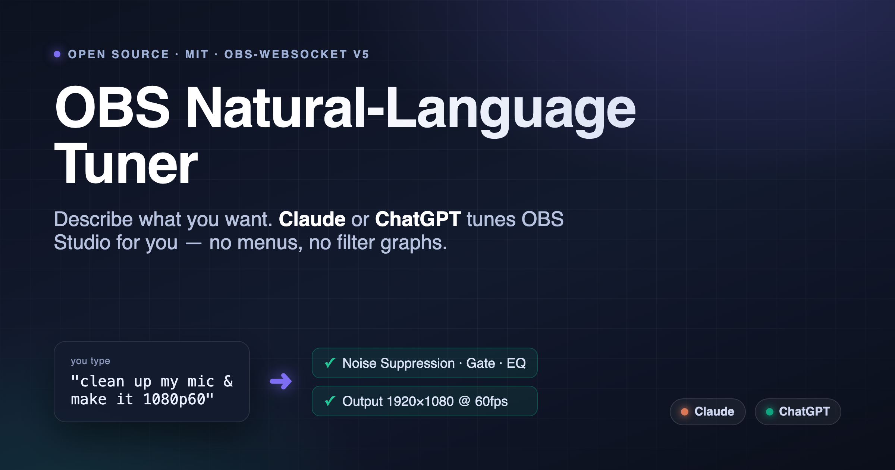
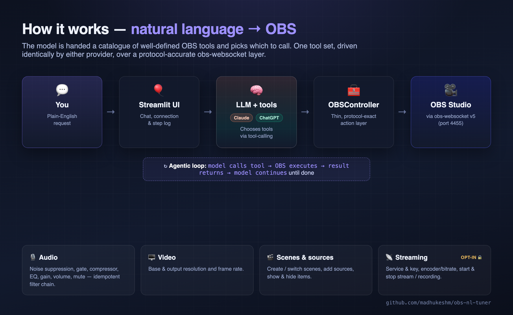

# 🎛️ OBS Natural-Language Tuner



[](./LICENSE)
[](https://www.python.org/)
[](https://streamlit.io/)

Configure **OBS Studio** by describing what you want in plain English. Your
request goes to **Claude** or **ChatGPT** (you supply the API key), the model
picks the right OBS actions, and the app carries them out over **obs-websocket
v5** — no menus, no filter graphs, no docs-diving.

> *"Clean up my mic and remove background noise."*
> *"Set my output to 1080p at 60 fps."*
> *"Make a 'Starting Soon' scene and switch to it."*
> *"Lower the desktop audio by 6 dB."*

📖 **Background:** [*Tuning OBS by Just Asking*](./docs/medium-article.md) — the why and how behind the project.

---

## How it works



Instead of asking a model to emit raw config JSON (fragile), the model is given
a set of well-defined OBS **functions** and uses native **tool calling** to
decide which to run and with what arguments. One canonical tool catalogue is
converted to each provider's wire format, so Claude and ChatGPT drive the exact
same, protocol-accurate OBS layer.

## What it can control

| Area | Examples |
|------|----------|
| **Audio** | Noise suppression (RNNoise), noise gate, compressor, 3-band EQ, gain; per-input volume; mute. Filters are idempotent — re-running updates instead of duplicating. |
| **Video** | Base (canvas) and output (scaled) resolution, frame rate. |
| **Scenes & sources** | Create / switch scenes, list sources, add inputs, show/hide items. |
| **Streaming / recording** | Stream service + key, encoder & bitrate (via profile parameters), start/stop stream and recording. |

> ⚠️ **Streaming/recording tools are OFF by default.** They can start a *public
> broadcast* or change your stream key, so they're hidden until you flip the
> **"Allow streaming / recording controls"** toggle in the sidebar.

---

## Setup

### Prerequisites

- **OBS Studio 28+** — obs-websocket v5 is built in (no plugin needed).
- **Python 3.12+**
- **[uv](https://docs.astral.sh/uv/)** — `curl -LsSf https://astral.sh/uv/install.sh | sh`
- An **API key** for either [Anthropic (Claude)](https://console.anthropic.com/)
  or [OpenAI (ChatGPT)](https://platform.openai.com/api-keys).

### 1. Enable the OBS WebSocket server

In OBS: **Tools → WebSocket Server Settings** → check **Enable WebSocket
server**. Note the **Port** (default `4455`) and click **Show Connect Info** to
see the **Password**. Leave auth on.

### 2. Install & run

```bash
git clone https://github.com/madhukeshm/obs-nl-tuner.git
cd obs-nl-tuner
uv sync
uv run streamlit run app.py
```

The app opens in your browser (default `http://localhost:8501`).

### 3. First run

In the sidebar:

1. **Connect** — enter host/port/password and click *Connect*.
   *(On macOS the password auto-fills from your local OBS config.)*
2. **Pick a provider** — Claude or ChatGPT — and a model.
3. **Paste your API key.**
4. Type a request in the chat box, e.g. *"clean up my mic"*.

Each turn shows the exact tools the assistant ran (expand them to see arguments
and results) followed by a plain-language summary of what changed.

---

## Configuration

API keys and connection details can be entered in the UI, **or** provided via a
`.env` file (copy [`.env.example`](./.env.example)):

```dotenv
ANTHROPIC_API_KEY=sk-ant-...
OPENAI_API_KEY=sk-...
OBS_WS_HOST=localhost
OBS_WS_PORT=4455
OBS_WS_PASSWORD=...
```

Values in the sidebar always win over `.env`. **The app never writes your keys
or password to disk.**

## Security & privacy

- **Your keys stay local.** They're held in the Streamlit session and sent only
  to the provider you chose (Anthropic or OpenAI). Nothing is persisted by the app.
- **The OBS password** is read live from your local OBS config purely to
  pre-fill the field (macOS convenience); it is not stored or committed.
- **Streaming is gated.** Start/stop stream, stream-key changes, and encoder
  changes require the explicit sidebar opt-in.
- `.env` and Streamlit secrets are git-ignored.

---

## Project layout

```
app.py                  Streamlit UI + chat loop
obs_tune/
  obs_actions.py        OBSController — thin, protocol-exact obs-websocket v5 wrapper
  tools.py              Tool catalogue + dispatch + Anthropic/OpenAI format conversion
  agents.py             Manual agentic loop for Claude and for ChatGPT (kept symmetric)
  prompts.py            Shared system prompt (includes an OBS filter cheat-sheet)
```

## Adding a new capability

Everything flows from one catalogue. To add a tool:

1. Add a method to `OBSController` in `obs_tune/obs_actions.py` that performs the
   obs-websocket request (use `self._req("RequestType", {...})`).
2. Append an entry to `_CATALOGUE` in `obs_tune/tools.py` with a `name`,
   `description`, JSON-schema `parameters`, and a `handler` lambda. Tag it
   `[STREAMING_TAG]` if it's a side-effectful streaming/recording action.

That's it — the tool is automatically exposed to both Claude and ChatGPT and
appears in the UI. No provider-specific code to touch.

---

## Troubleshooting

| Symptom | Fix |
|---------|-----|
| **"Could not connect to OBS"** | Is OBS running? Is the WebSocket server enabled (Tools → WebSocket Server Settings)? Do the port and password match? |
| **Auth failed / wrong password** | Copy the password from *Show Connect Info* in OBS, or clear it if auth is disabled. |
| **"No source was found by the name of …"** | Source/scene names are case-sensitive. Ask the assistant to *"list my inputs"* first, or check the names in OBS. |
| **Mic filters do nothing** | Grant OBS microphone permission (macOS: System Settings → Privacy & Security → Microphone) and confirm the mic input isn't muted. |
| **Bitrate change had no effect** | Bitrate lives in profile settings; the encoder must be in **Simple** output mode for `SimpleOutput/VBitrate`. Advanced mode uses different keys. |
| **API key error** | Check the key matches the selected provider and has credit/quota. |

## Notes & limits

- obs-websocket has **no dedicated bitrate/encoder request** — those are set
  through **profile parameters** (`SetProfileParameter`), which this app exposes.
- Remote-starting a stream requires the destination to be configured in OBS.
- Verified against **OBS 32.2.2 / obs-websocket 5.7.4** on macOS.

## License

[MIT](./LICENSE) © Madhukesh Manevarthe
